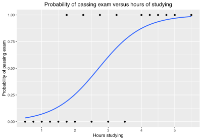

# Logistic Regression

Uses a formula

//add

Where theta is a weight parameter you use to optimize your data and x is your input. 
Notice that it is theta TRANSPOSED.

Formula below:

```python
import numpy as np
import math

def fx(x, teta):
    return np.dot(np.array(teta).T, np.array(x))

def sigmoid_function(x, teta):
    return 1 / (1 + math.exp(-fx(x, teta)))

def logistic_regression(X, teta, threshold=0.5):
    y = []
    for x in X:
        y_proba = sigmoid_function(x, teta)
        y_class = 1 if y_proba > threshold else 0
        y.append([y_class, y_proba])
    return y
```

To plot:

```python
import matplotlib.pyplot as plt

def plot_log_reg(X, teta):
    # Plot sigmoid function
    func = np.arange(-6, 6, 0.2)
    for x in func:
        plt.plot([fx(x, 1)], sigmoid_function(x, 1), '.', color='black')

    # Plot points of your predictions
    for x in X:
        plt.plot([fx(x, teta)], [sigmoid_function(x, teta)], 'o', color='red')
    plt.xlim(-6, 6)
    plt.ylim(0, 1.1)
```



---
# References

https://www.mastersindatascience.org/learning/machine-learning-algorithms/logistic-regression/