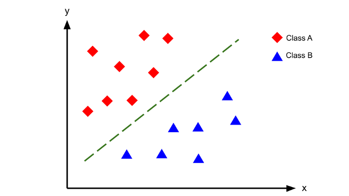

# SVC

It's a C-Support Vector Classification.

The objective of a Linear SVC (Support Vector Classifier) is to fit to the data you 
provide, returning a "best fit" hyperplane that divides, or categorizes, your data.

## Parameters

- `kernel`: kernel parameters selects the type of hyperplane used to separate the data. 
Using ‘linear’ will use a linear hyperplane (a line in the case of 2D data). ‘rbf’ and 
‘poly’ uses a non linear hyper-plane.
- `gamma` `default='scale'`: is a parameter for non linear hyperplanes. The higher the 
gamma value it tries to exactly fit the training data set. We can see that increasing gamma leads to **overfitting** as the classifier tries to perfectly fit the training data.
- `C` `default 1`: is the penalty parameter of the error term. It controls the trade off between smooth decision boundary and classifying the training points correctly. Increasing C values may lead to **overfitting** the training data. If you have a lot of noisy observations you should decrease it: decreasing C corresponds to more regularization.
- `degree`: is a parameter used when kernel is set to ‘poly’. It’s basically the degree of the polynomial used to find the hyperplane to split the data. Using degree=1 is the same as using a ‘linear’ kernel. Also, increasing this parameters leads to higher training times.
- `decision_function_shape` `{‘ovo’, ‘ovr’}, default 'ovr'`: one-vs-one (‘ovo’) is always used as multi-class strategy. The parameter is ignored for binary classification.
- `max_iter` `default=-1`: Hard limit on iterations within solver, or -1 for no limit. “Paolla: Maybe it is the number of lines in the dataset. A small amount will reduce overfit.”
- `shrinking` `default True`: We found that if the number of iterations is large, then shrinking can shorten the training time. However, if we loosely solve the optimization problem (e.g., by using a large stopping tolerance), the code without using shrinking may be much faster

---
# References

https://scikit-learn.org/stable/modules/svm.html

https://medium.com/all-things-ai/in-depth-parameter-tuning-for-svc-758215394769

https://data-flair.training/blogs/svm-support-vector-machine-tutorial/

https://medium.com/it-paragon/grid-search-f24a73a8a0ac