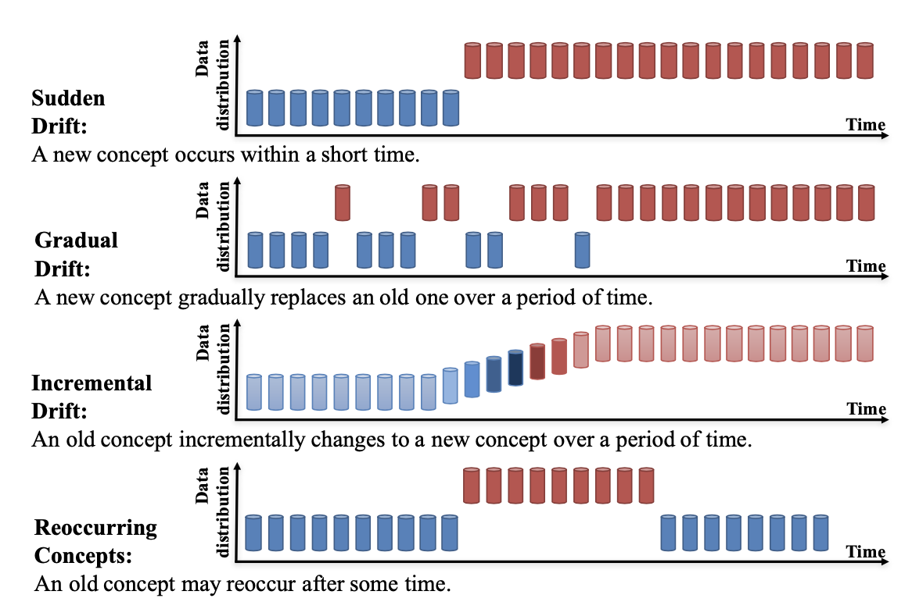

# Concept drift

Concept drift describes unforeseeable changes in the underlying distribution of streaming data over time. It means that the **statistical properties of the target variable change over time**. If the concept drift occurs, the induced pattern of past data may not be relevant to the new data, leading to poor predictions and decision outcomes.

Concept drift research involves the development of methodologies and techniques for:
- drift detection
- understanding and 
- adaptation

Conventional machine learning has two main components: training/learning and prediction. Research on learning under concept drift presents three new components: 
- drift detection (whether or not drift occurs), 
- drift understanding (when, how, where it occurs) 
- and drift adaptation (reaction to the existence of drift) 

**Other names**

Concept drift has also been defined by various authors
using alternative names, such as dataset shift [15] or concept shift [1]

**Types**

Commonly, concept drift can be distinguished as four types:

- Research into concept drift adaptation in Types 1-3 focuses on how to minimize the drop in accuracy and achieve the fastest recovery rate during the concept transformation process.

- The study of Type 4 drift emphasizes the use of historical concepts, that is, how to find the best matched historical concepts with the shortest time.

- To better demonstrate the differences between these types, the term “intermediate concept” was introduced to describe the transformation between concepts.

### Drift detection

Drift detection refers to the techniques and mechanisms that characterize and quantify concept drift via identifying **change points** or **change time intervals**.

**General Framework**

A general framework for drift detection contains four stages:
1. Stage 1 (Data Retrieval): aims to retrieve data chunks from data streams. Since a single data instance cannot carry enough information to infer the overall distribution, knowing how to organize data chunks to form a meaningful pattern or knowledge is important in data stream analysis tasks.
2. Stage 2 (Data Modeling): aims to abstract the retrieved data and extract the key features containing sensitive information, that is, the features of the data that most impact a system if they drift. **This stage is optional**, because it mainly concerns dimensionality reduction, or sample size reduction, to meet storage and online speed requirements.
3. Stage 3 (Test Statistics Calculation): is the measurement of dissimilarity, or distance estimation. It quantifies the severity of the drift and forms test statistics for the hypothesis test. It is consideredto be the most challenging aspect of concept drift detection. The problem of how to define an accurate and robust dissimilarity measurement is still an open question. A dissimilarity measurement can also be used in clustering evaluation, and to determine the dissimilarity between sample sets.
4. Stage 4 (Hypothesis Test) uses a specific hypothesis test to evaluate the statistical significance of the change observed in Stage 3, or the p-value. They are used to determine drift detection accuracy by proving the statistical bounds of the test statistics proposed in Stage 3. Without Stage 4, the test statistics acquired in Stage 3 are meaningless for drift detection, because they cannot determine the drift confidence interval, that is, how likely it is that the change is caused by concept drift and not noise or random sample selection bias [3]. The most commonly used hypothesis tests are: estimating the distribution of the test statistics [19], [20], bootstrapping [21], [22], the permutation test [3], and Hoeffding’s inequality-based bound identification [23].

#### Algorithms

They can be:
1. Error rate-based drift detection
2. Data Distribution-based Drift Detection
3. Multiple Hypothesis Test Drift Detection

...

---

# References

Learning under Concept Drift- A Review