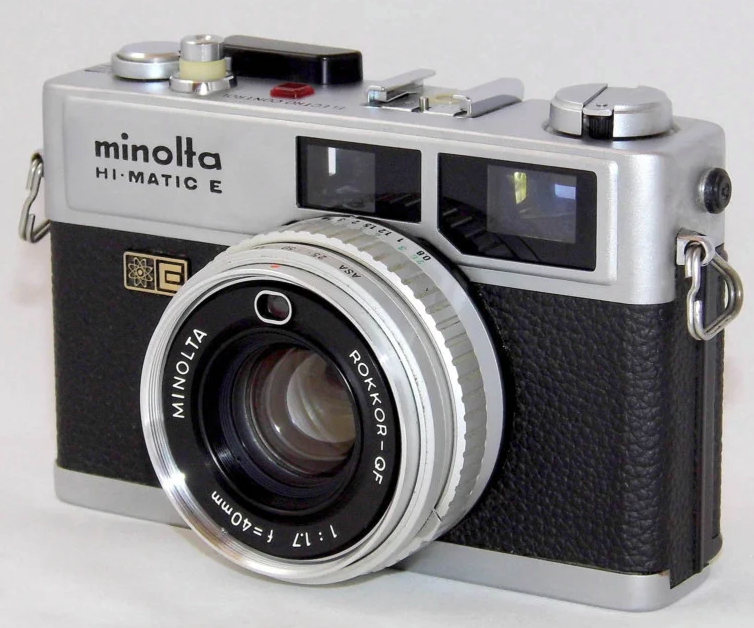
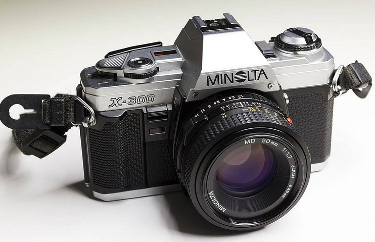
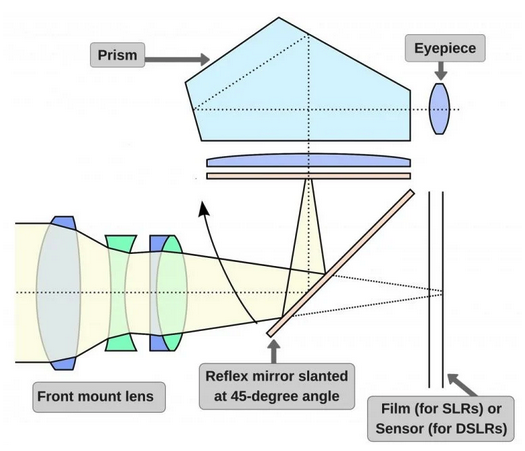
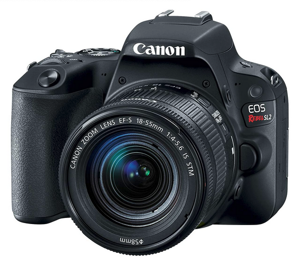
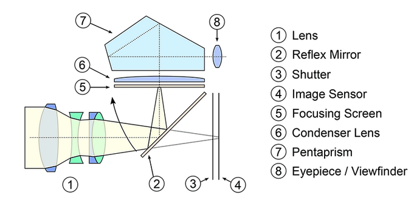
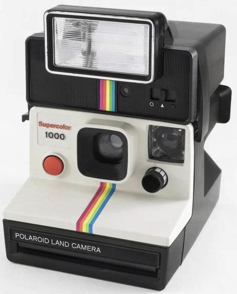
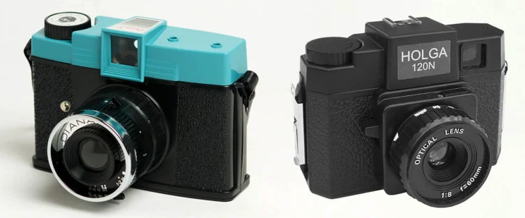

# Tipos de cameras

## Índice

- [Tipos de cameras](#tipos-de-cameras)
  - [Índice](#índice)
  - [Timeline](#timeline)
  - [Tipos de câmeras](#tipos-de-câmeras)
    - [**Rangefinder**](#rangefinder)
    - [**SLR**](#slr)
    - [**DSLR**](#dslr)
    - [**TLR**](#tlr)
    - [***Point-and-Shoot*/*compact*/"saboneteira"**](#point-and-shootcompactsaboneteira)
    - [**Instantaneas**](#instantaneas)
    - [**Descartáveis**](#descartáveis)
    - [***Toy Cameras*/Brinquedo**](#toy-camerasbrinquedo)
    - [**Stereo Cameras**](#stereo-cameras)
    - [**Panoramic Camera**](#panoramic-camera)
    - [**Folding Cameras**](#folding-cameras)
    - [**Box Cameras**](#box-cameras)
    - [**Pinhole Cameras**](#pinhole-cameras)
    - [**Press Camera**](#press-camera)
- [References](#references)

## Timeline

## Tipos de câmeras

### **Rangefinder**

Este tipo de camera utiliza uma janela separada para visualizar e focalizar a imagem a ser tirada. Em outras palavras, a imagem que é tirada não é a mesma que é visualizada pelo visor. Esta janela é chamada de Rangefinder. O sistema de focalização desse tipo de câmera é bem interessante: existem duas imagens mostradas no visor e, para focalizar, você deve mover o mecanismo de foco até ver as duas imagens virarem uma só.

Este tipo de câmera, por não ter dispositivos tão complexos, tende a ser mais compacto e fácil de levar para qualquer lugar. Quanto às lentes, a maioria dessas câmeras foram feitas com lentes fixas, entretanto, ainda existem algumas que possui um mecanismo de troca de lentes.

### **SLR**

SLR significa Single Lens Reflex. Ela projeta a imagem vista pela lente através de um espelho para o visor (ou do inglês, *viewfinder*). A imagem abaixo demonstra os componentes desse tipo de câmera.

Com estas, temos controle da velocidade do obturador, abertura e ISO, dentre outras. Também é possível, com este tipo de câmera, trocar as lentes. Elas eram comumente fabricadas para filmes de 35mm, entretanto existe este tipo de câmera para filmes de médio formato.

### **DSLR**

É basicamente uma SLR digital (é o que o D de DSLR significa). Tudo o que se aplica para uma SLR se aplica para este tipo de câmera. Existem algumas diferenças entre as duas, mas a principal é que em vez de o filme, temos um sensor de imagem (vide imagem abaixo: item 4 que muda entre as duas). Outras diferenças que podem ser citadas, são a quantidade de botões (na SLR temos mais por conta de configurações antes feitas por estes, são feitas agora de maneira digital ou automática); o peso (a SLR é menor pois contem menos equipamentos eletrônicos dentro); a quantidade de poses disponiveis (na SLR somos limitadas pela quantidade de poses disponíveis no filme enquanto que na D temos um cartão de memória que cabe inúmeras poses); dentre outras.

### **TLR**

### ***Point-and-Shoot*/*compact*/"saboneteira"**

### **Instantaneas**

### **Descartáveis**

### ***Toy Cameras*/Brinquedo**

### **Stereo Cameras**

### **Panoramic Camera**

### **Folding Cameras**

### **Box Cameras**

### **Pinhole Cameras**

### **Press Camera**

# References

<https://www.scienceabc.com/innovation/whats-difference-between-slr-dsl-digital-photographs-film-memory-card-cameras.html>

<https://petapixel.com/types-of-film-cameras/>
