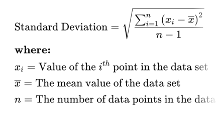

# Standard Deviation (aka Variance)

- Standard deviation is a statistic that measures the dispersion of a dataset relative to its mean  
- The standard deviation is calculated as the square root of variance by determining
each **data point's deviation relative to the mean**.
- If the data points are further from the mean, there is a higher deviation 
within the data set; thus, the more spread out the data, the higher the 
standard deviation. 

**Formula:**

Standard deviation is calculated as follows:

1. Calculate the **mean** of all data points. The mean is calculated by adding all 
the data points and dividing them by the number of data points.
2. Calculate the **variance** for each data point. The variance for each data point 
is calculated by **subtracting the mean from the value of the data point**.
3. **Square the variance** of each data point (from Step 2).
4. **Sum of squared variance values** (from Step 3).
5. Divide the sum of squared variance values (from Step 4) by the number of data 
points in the data set less 1.
6. **Take the square root of the quotient** (from Step 5).

# References
https://www.investopedia.com/terms/s/standarddeviation.asp